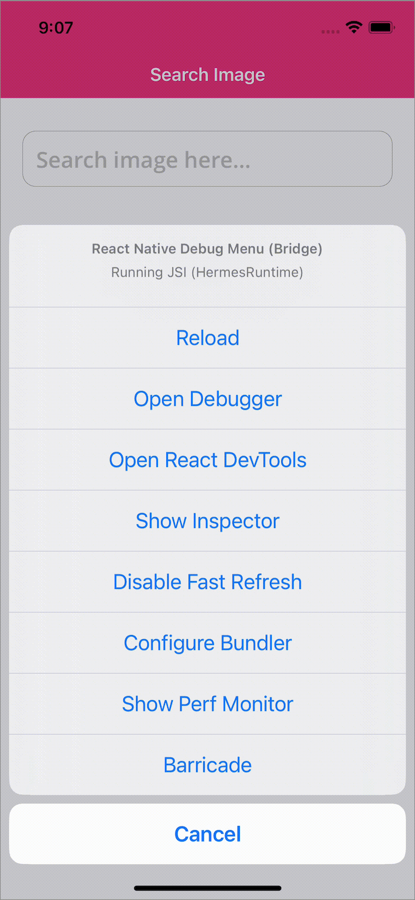
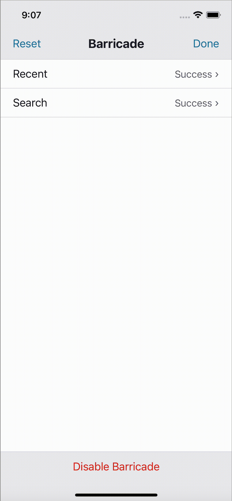
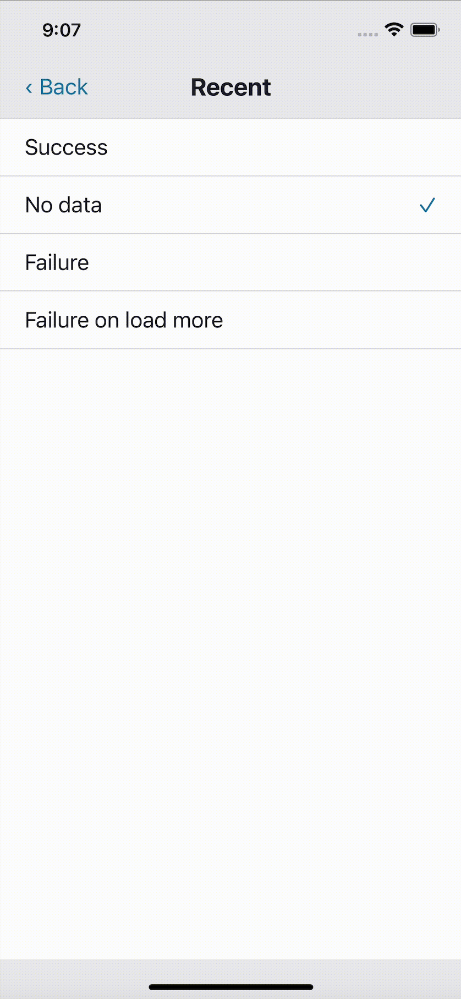

# react-native-barricade

A runtime configurable local server to develop, test and prototype your react-native app. With just mock responses, the whole application can be built without being blocked due to unavailability of APIs. `Barricade` works by replacing the global `XMLHttpRequest` and `fetch` object with the `MockedXMLHttpRequest`. It blocks all outgoing network calls that are configured with Barricade and returns a registered local response without requiring any changes to the existing network code.

# Why react-native-barricade?

Most other local server implementations only support a single response per request, but Barricade supports multiple responses per request. This allows us to present the user with an interface for modifying which response will be returned for a request at runtime.

<p align="center">

</p>

# When to use?

During development, barricade is useful for easily exercising all edge cases of a feature while you are building it without needing to frequently adjust the live server state.

For unit tests and integration tests barricade allows you to easily toggle through each predefined response for a request so tests can cover edge cases thoroughly.

## Features

- Mock API responses.
- Dynamically change mocked API responses at runtime.
- Disable mocking API responses at runtime.
- Support both android and iOS platforms.
- Built-in typescript definitions.

## Installation
```bash
$ npm install --save react-native-barricade
# --- or ---
$ yarn add react-native-barricade
```
## Usage

**1. Create and Start Barricade**

Create an instance of Barricade with the help of `createBarricade` function along with an array of `RequestConfig` as function argument.

**:warning: Make sure to do this in index.js so that Barricade is created before hitting any API**

```tsx
import { createBarricade } from 'react-native-barricade';

const requestConfig = []; // Array of RequestConfigs for all the APIs that needs to be mocked
const barricade = createBarricade(requestConfig);
barricade.start(); // Start the barricade

AppRegistry.registerComponent('App', () => App);
```

**2. Add BarricadeView**

Add `BarricadeView` to your root component(App.tsx) of your app. This shows the list of mocked APIs and is used to change the selected response at runtime.

**:warning: Make sure to add BarricadeView at the end so that it overlays the entire app**

```tsx
import { BarricadeView } from 'react-native-barricade';

const App = () => {
  return (
    <View>
      /* Rest of your app */
      <BarricadeView />
    </View>
  );
};
```
**BarricadeView:**  
| Property              | Description                                                                                                                                                            | Type                      |
| --------------------- | ---------------------------------------------------------------------------------------------------------------------------------------------------------------------- | ------------------------- |
| **`theme`**           | Use this to select the preferred color scheme. It can be `dark` or `light` and by default its `light`.                                                                 | `ThemeType` / `undefined` |

**3. Create RequestConfigs**

We need to create a `RequestConfig` for each API that should be mocked. Then these need to be added to the list of request configs shown in step 1.

**RequestConfig:**  
| Property              | Description                                                                                                                                                            | Type                      |
| --------------------- | ---------------------------------------------------------------------------------------------------------------------------------------------------------------------- | ------------------------- |
| **`label`**           | String used to identify the request by the developer in BarricadeView.                                                                                                 | `string`                  |
| **`method`**          | Request method type. It can be `Delete`, `Get`, `Head`, `Options`, `Patch`, `Post` or `Put`.                                                                           | `Method`                  |
| **`pathEvaluation`**  | Data used to identify the current API triggered from the list of RequestConfigs.                                                                                       | `PathEvaluation`          |
| **`responseHandler`** | List of mocked responses the current API can return with. By default, the first response from the list is selected.                                                    | `ResponseHandler[]`       |
| **`delay`**           | Time in milliseconds the barricade needs to wait before responding with the mocked response. This is optional and it defaults to `400`.                                | `number` / `undefined`    |

**PathEvaluation:**  
| Property              | Description                                                                                                                                                            | Type                      |
| --------------------- | ---------------------------------------------------------------------------------------------------------------------------------------------------------------------- | ------------------------- |
| **`path`**            | Request URL endpoint.                                                                                                                                                  | `string`                  |
| **`type`**            | Type of evaluation that needs to be done on path/request to identify the RequestConfig. It can be `Callback`, `Include` or `Suffix`.                                   | `PathEvaluationType`      |
| **`callback`**        | Function used to identify if this requestConfig needs to be used for resolving the current API with the help of `Request` argument.                                    | `function`                |

**PathEvaluationType:**  
| Enum Options          | Description                                                                                                                                                            | Type                      |
| --------------------- | ---------------------------------------------------------------------------------------------------------------------------------------------------------------------- | ------------------------- |
| **`Callback`**        | Use this when you cannot identify the RequestConfig with just the help of `path` along with the `callback` function in `pathEvaluation`.                               | `number`                  |
| **`Include`**         | Use this when the `path` passed in `pathEvaluation` can be anywhere within the Request URL.                                                                            | `number`                  |
| **`Suffix`**          | Use this when the `path` passed in `pathEvaluation` must be at the end of the Request URL.                                                                             | `number`                  |

**ResponseHandler:**  
| Property              | Description                                                                                                                                                            | Type                      |
| --------------------- | ---------------------------------------------------------------------------------------------------------------------------------------------------------------------- | ------------------------- |
| **`label`**           | String used to identify the response by the developer in BarricadeView.                                                                                                 | `string`                  |
| **`handler`**         | Function that returns the mocked response for the current API call. It can also tweak the response with the help of the `Request` argument.                                | `function`                |
| **`isSelected`**      | Used to identify the selected response from the `ResponseHandler[]`. This is optional and by default the first response from the list will be selected by Barricade.    | `boolean` / `undefined`   |

## Example

In this example, we will setup react-native-barricade to be able to respond to `flickr search` API with one of two possible responses.

```tsx
const SearchApiRequestConfig: RequestConfig = {
  label: 'Search',
  method: Method.Get,
  pathEvaluation: {
    path: '/services/rest?method=flickr.photos.search',
    type: PathEvaluationType.Includes,
  },
  responseHandler: [
    {
      label: 'Success',
      handler: successResponseHandler, // function that returns success data based on some computation
    },
    {
      label: 'Failure',
      handler: () => {
        return {
          status: HttpStatusCode.BAD_REQUEST,
          headers: { 'Content-Type': 'application/json' },
          response: JSON.stringify(errorData), // JSON formatted error response.
        };
      },
    },
  ],
};
```

Everytime we hit the above API, barricade executes the `successResponseHandler` function and returns the response data. This function will be useful in cases like below where we have to return the paginated response to the same API call.

```tsx
const successResponseHandler = (request: Request) => {
  const { page } = request.params ?? {};
  const response = page === '1' ? searchPageOne : searchPageTwo; // JSON responses

  return {
    status: HttpStatusCode.OK,
    headers: { 'Content-Type': 'application/json' },
    response: JSON.stringify(response),
  };
};
```

## Selection Interface

Barricade comes with an in-app interface that can be presented to allow selection of network responses at runtime. For this to be visible, you need to add `BarricadeView` mentioned in Step 2 of **Usage**.

<p align="center">



</p>

With this in place and the device is shaken, you will be able to see an option for `Barricade` in react-native's developer menu. On tapping the `Barricade` option you will be taken to the screen with a list of mocked APIs.

**:warning: The Developer Menu is disabled in release (production) builds**

If you want to use barricade in release mode, you will need to create a tappable text/button and call `showBarricadeView` on tapping the same.

App.tsx:
```tsx
import { BarricadeView, showBarricadeView } from 'react-native-barricade';

const App = () => {
  return (
    <View>
      /* Rest of your app */
      <Button onPress={showBarricadeView} title={"Open barricade view"}/>
      <BarricadeView />
    </View>
  );
};
```

**Note:** In BarricadeView, apart from changing the selected response for any of the listed APIs, we can also:
- Disable/Enable barricade. This will stop mocking all the APIs and you can check the app with actual response at runtime.
- Reset all the changes done to the list of selected responses.

## Store Submission

react-native-barricade is safe to include with store builds (and could be used to support things like a demo mode for your app), but most of the time you will probably want to ensure that the barricade is disabled for store builds. You can achieve this by wrapping the creation of barricade and BarricadeView inside an ENV check.

index.js:
```tsx
import { Env } from './src/config';

if (Env.enableBarricade) { // enableBarricade will be false in case of Production.
  const requestConfig = [];
  const barricade = createBarricade(requestConfig);
  barricade.start();
}
```

App.tsx:
```tsx
import { BarricadeView } from 'react-native-barricade';
import { Env } from './config';

const App = () => {
  return (
    <View>
      /* Rest of your app */
      {Env.enableBarricade && <BarricadeView />}
    </View>
  );
};
```

## Credits

react-native-barricade was created by [Prajna Boloor](https://www.linkedin.com/in/prajna-boloor/) at [Mutual Mobile](http://www.mutualmobile.com).

Credits also to the react-native team at Mutual Mobile for their feedback.

## License

Distributed under the MIT License. See [LICENSE.txt](https://github.com/mutualmobile/react-native-barricade/blob/feature/readme/LICENSE) for more information.


## Support Us

If this project has helped you out, please support us with a star 🌟.

## Acknowledgements

- [Pretender](https://github.com/pretenderjs/pretender)
- [FakeXMLHttpRequest](https://github.com/pretenderjs/FakeXMLHttpRequest)
